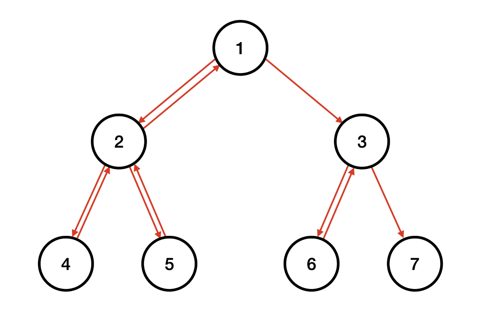
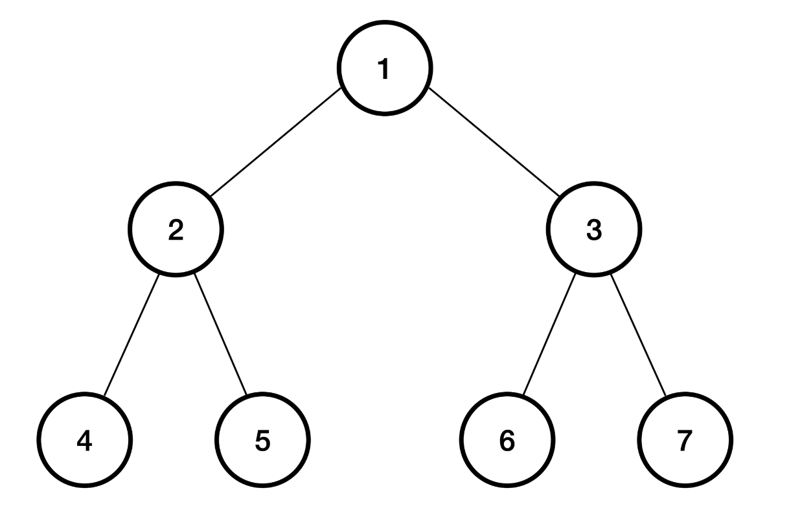

# boj_22856 트리순회
<a href = "https://www.acmicpc.net/problem/22856"> 문제 바로 가기 </a>

|**시간 제한**|**메모리 제한**|**제출**|**정답**|**맞힌 사람**|**정답 비율**|
|-----------|-------------|------|------|----------|----------|
| 1 초      |  1024 MB      | 3269 | 1028 |   744   | 30.219%  |

### 문제
노드가 
$N$개인 이진 트리가 있다. 트리를 중위 순회와 유사하게 순회하려고 한다. 이를 유사 중위 순회라고 하자.

순회의 시작은 트리의 루트이고 순회의 끝은 중위 순회할 때 마지막 노드이다. 이때 루트 노드는 항상 1번 노드이다.

유사 중위 순회는 루트 노드에서 시작하며, 다음과 같이 진행된다.

1. 현재 위치한 노드의 왼쪽 자식 노드가 존재하고 아직 방문하지 않았다면, 왼쪽 자식 노드로 이동한다.
2. 그렇지 않고 현재 위치한 노드의 오른쪽 자식 노드가 존재하고 아직 방문하지 않았다면, 오른쪽 자식 노드로 이동한다.
3. 그렇지 않고 현재 노드가 유사 중위 순회의 끝이라면, 유사 중위 순회를 종료한다.
4. 그렇지 않고 부모 노드가 존재한다면, 부모 노드로 이동한다.
5. 유사 중위 순회를 종료할 때까지 1 ~ 4를 반복한다.



위 그림에 있는 트리에서 중위 순회를 한다면 
$4 \rightarrow 2 \rightarrow 5 \rightarrow 1 \rightarrow 6 \rightarrow 3 \rightarrow 7$ 순으로 순회를 한다.

따라서, 유사 중위 순회의 끝은 노드 7이 된다.



### 입력
첫 번째 줄에 트리를 구성하는 노드의 개수 
$N$이 주어진다.

두 번째 줄부터 
$N + 1$ 번째 줄까지 현재 노드 
$a$, 현재 노드의 왼쪽 자식 노드 
$b$, 현재 노드의 오른쪽 자식 노드 
$c$가 공백으로 구분되어 주어진다. 만약 자식 노드의 번호가 -1인 경우 자식 노드가 없다는 것을 의미한다.

### 출력
유사 중위 순회를 하면서 이동한 총 횟수를 출력한다.

### 제한
$1 \le N \le 100,000$ 
 
$1 \le a, b \le N$

### 예제 입력 1
```
7
1 2 3
2 4 5
3 6 7
4 -1 -1
5 -1 -1
6 -1 -1
7 -1 -1
```

### 예제 출력 1
```
10
```

$1 \rightarrow 2 \rightarrow 4 \rightarrow 2 \rightarrow 5 \rightarrow 2 \rightarrow 1 \rightarrow 3 \rightarrow 6 \rightarrow 3 \rightarrow 7$ 

### 예제 입력 2
```
1
1 -1 -1
```

### 예제 출력 2
```
0
```